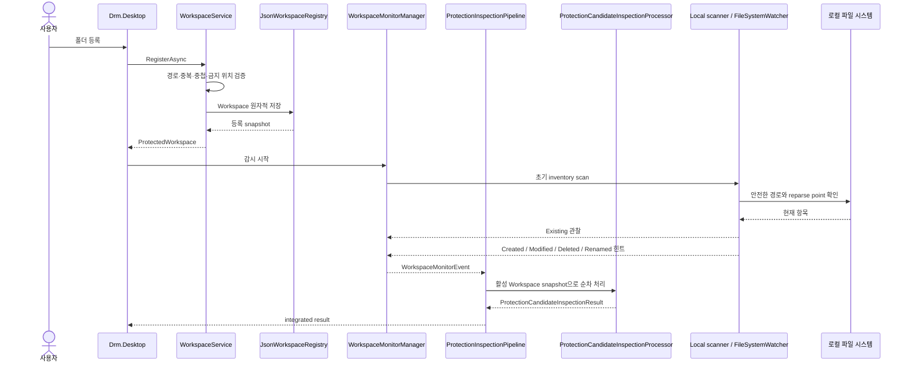
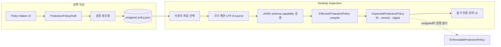
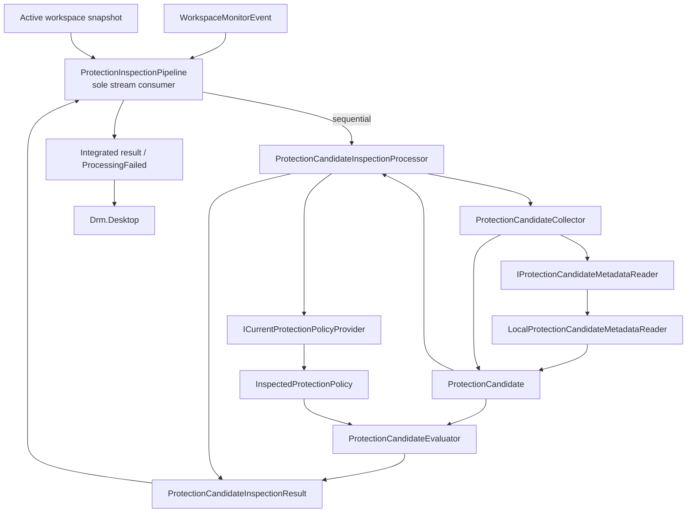
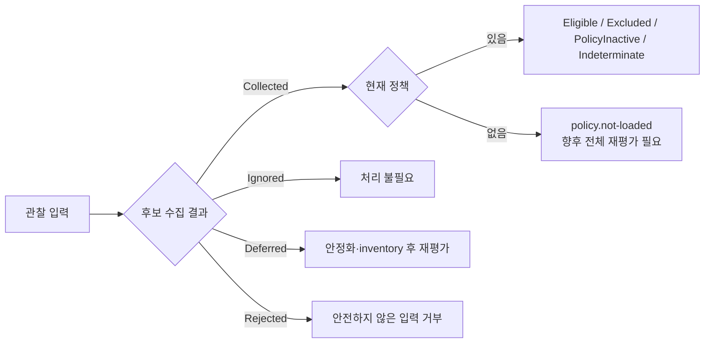

# 아키텍처 실행 흐름

이 문서는 [DRM 아키텍처](architecture.md)의 전체 지도에서 중요한 runtime 흐름을 단계별로 확대합니다. 실선은 현재 연결된 동작이고 점선은 구현된 계약이 아직 runtime에 연결되지 않았거나 향후 구현할 경계입니다.

## Workspace 등록과 관찰

등록은 Workspace metadata만 저장하며 실제 폴더나 파일을 변경하지 않습니다. 초기 scan은 현재 inventory를 만들고 `FileSystemWatcher`는 이후 변화를 빠르게 알리는 힌트입니다. watcher 오류나 channel 포화가 발생하면 `Degraded`로 전환하고 재스캔하여 상태를 조정합니다.

`ProtectionInspectionPipeline`은 broadcast가 아닌 `WorkspaceMonitorManager` stream의 유일한 consumer이며 활성 Workspace snapshot을 소유합니다. manager와 pipeline의 channel은 출력을 조용히 폐기하지 않습니다. 로컬 channel이 포화되면 reconciliation을 요청하여 누락 가능성이 있는 관찰을 권위 있는 inventory scan으로 보정합니다.

## 정책 작성과 inspection

Policy Maker와 Desktop은 동일한 `Drm.Policy` 계약을 사용하지만 파일을 신뢰 경계로 취급하므로 Desktop이 JSON을 다시 읽고 검증합니다. Debug 구성은 unsigned Draft를 inspection 목적으로 허용할 수 있고 Release 구성은 거부합니다.

snapshot의 SHA-256 digest는 로컬 내용 식별자이지 전자서명이나 발행자 신뢰 증명이 아닙니다. 성공한 snapshot도 Workspace에 자동 연결되지 않으며 파일 보호 작업을 만들지 않습니다.

## 보호 후보 수집과 inspection 평가

pipeline과 processor는 다음 순서를 보장합니다.

1. pipeline이 활성 Workspace snapshot에서 event의 Workspace를 확인하고 event를 하나씩 순차 처리합니다.
2. processor가 관찰이 후보 수집 대상인지 판단합니다. `Deleted`는 무시하고 age를 확정할 수 없는 `Modified`·`Renamed`는 재평가 대상으로 미룹니다.
3. Local reader가 Workspace 탈출, rooted 경로와 reparse point를 거부하고 파일 종류·확장자·크기·version stamp를 수집합니다.
4. 완전한 후보가 만들어졌을 때만 현재 정책 snapshot을 정확히 한 번 읽습니다.
5. 정책이 있으면 항상 `Inspection` mode로 순수 evaluator를 호출합니다.
6. 정책이 없거나 수집이 완료되지 않으면 구조화된 reason code를 보존하며 임의로 성공·제외로 바꾸지 않습니다.
7. pipeline이 monitor 정보와 processor 결과를 integrated result로 결합하여 Desktop에 전달합니다. 개별 event의 예상하지 못한 예외는 `ProcessingFailed`로 변환하여 다음 event 처리와 stream 수명을 보호합니다.

runtime monitor stream과 Desktop 결과 전달은 현재 연결되어 있습니다. 다만 정책 load 이후 기존 후보의 자동 재평가, 파일 안정성 확인, 자동 retry, durable queue와 암호화는 아직 구현되지 않았습니다. local saturation은 reconciliation을 요청하지만 durable queue나 event별 재실행을 제공하지는 않습니다.

## 실패와 재평가 경계

`Eligible`은 향후 보호 작업 후보가 될 수 있다는 inspection 결과일 뿐 보호 완료가 아닙니다. `Deferred`도 현재 자동 retry를 뜻하지 않습니다. 실제 집행 경계에서는 신뢰된 정책, 안정화된 파일 handle, 재수집한 metadata, durable queue, 멱등적인 영속 작업, 암호화와 비정상 종료 복구가 추가로 필요합니다.
