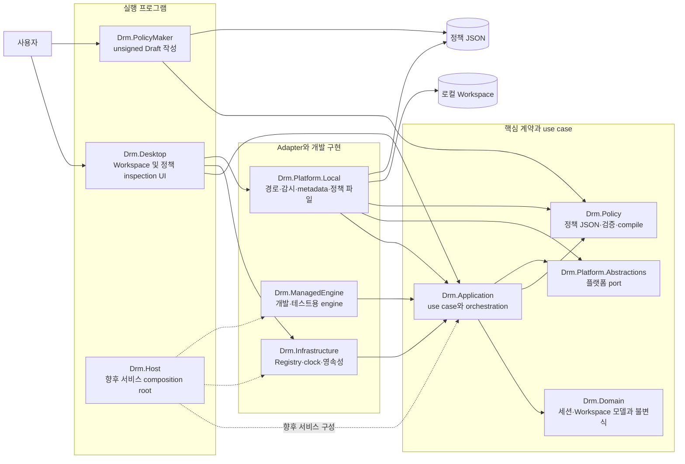
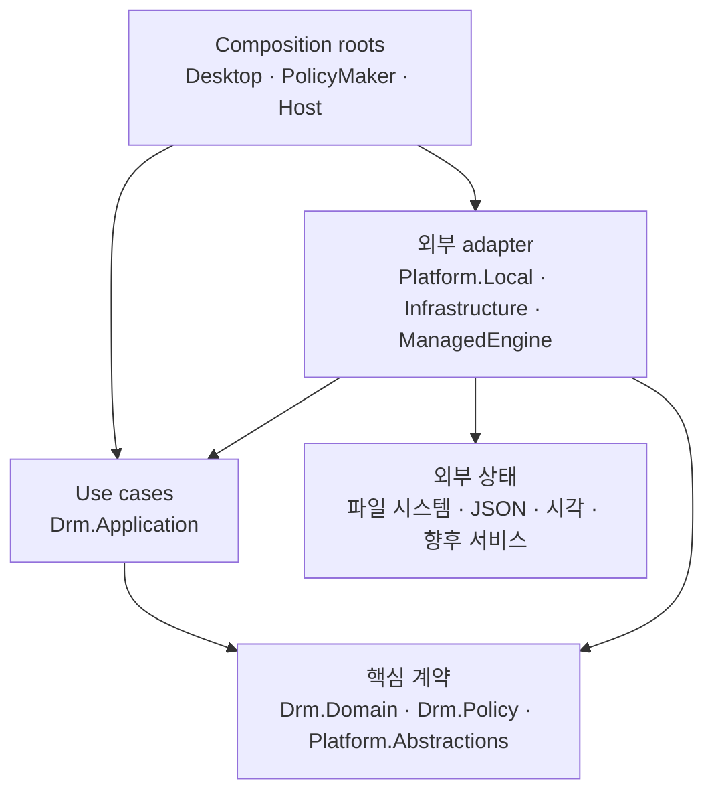
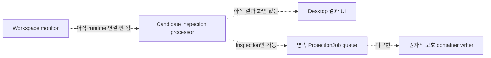

# DRM 아키텍처

## 현재 범위

이 저장소는 DRM 세션 생명주기, 로컬 Workspace 등록·관찰, 보호 정책 Draft 작성·검증, 보호 후보 수집·inspection 평가 기반을 제공합니다.

현재 구현은 운영 DRM이 아닙니다. 파일 암호화, 신뢰된 정책 서명, 라이선스 발행, 장치 binding, 변조 방지와 운영체제 수준 접근 통제를 제공하지 않습니다. 아래 그림의 점선 영역은 계약이나 기반만 존재하며 실제 집행 흐름에는 아직 연결되지 않았음을 뜻합니다.

## 전체 시스템 지도

그림에서 위쪽은 사용자와 직접 만나는 실행 프로그램, 가운데는 운영체제와 UI에 독립적인 계약과 판단, 아래쪽은 파일 시스템·영속성 같은 외부 환경 adapter입니다. `Drm.Desktop`과 `Drm.PolicyMaker`는 서로 참조하지 않고 `Drm.Policy`의 정책 계약만 공유합니다.

## 계층과 의존 방향

의존 방향의 기준은 다음과 같습니다.

- `Drm.Domain`은 세션과 Workspace의 언어 독립 모델 및 불변식을 정의합니다.
- `Drm.Policy`는 정책 문서와 runtime 정책 계약을 소유하며 UI나 파일 시스템을 알지 않습니다.
- `Drm.Application`은 port와 핵심 계약을 조합해 use case를 수행하지만 구체적인 로컬 파일 API를 직접 호출하지 않습니다.
- `Drm.Platform.Local`, `Drm.Infrastructure`, `Drm.ManagedEngine`은 Application이 정의한 경계를 실제 환경에 연결합니다.
- 실행 프로그램은 객체 수명과 구현 선택을 담당하는 composition root입니다. 현재 Desktop이 주 실행 경로이고 Host는 향후 서비스 구성을 위한 자리입니다.

프로젝트 간 실제 `ProjectReference`에는 adapter가 Application 계약을 구현하기 위한 역방향 참조가 포함됩니다. 따라서 그림은 소스 파일 참조의 단순 위아래가 아니라 책임과 제어 흐름을 기준으로 읽어야 합니다.

## 주요 실행 흐름

현재 구현에는 세 개의 중심 흐름이 있습니다.

1. Workspace 등록·관찰: Desktop이 폴더를 등록하고 Local adapter가 초기 scan과 `FileSystemWatcher` 관찰을 제공합니다.
2. 정책 작성·inspection: Policy Maker가 unsigned JSON Draft를 만들고 Desktop이 같은 계약으로 다시 검증해 불변 snapshot을 게시합니다.
3. 보호 후보 inspection: 관찰을 안전한 metadata snapshot으로 수집한 뒤 현재 inspection 정책으로 순수 평가합니다.

세 흐름의 단계별 그림과 실패·보안 경계는 [아키텍처 실행 흐름](architecture-flows.md)에 분리해 설명합니다.

## 현재 연결 상태

후보 collector·evaluator·processor는 테스트 가능한 Application 기반으로 구현되어 있지만 monitor stream의 실제 consumer로 아직 연결되지 않았습니다. 따라서 현재 Desktop의 `Watching`과 정책 inspection 성공은 파일 보호가 수행된다는 의미가 아닙니다.

## 보안 경계

1. 검증되지 않은 `ProtectionPolicyDocument`를 runtime 집행 입력으로 사용하지 않습니다.
2. unsigned inspection 정책을 enforceable 정책으로 변환하지 않습니다.
3. 정책 identity 불일치는 fail-closed인 `PolicyInactive`로 처리합니다.
4. metadata가 완전하지 않으면 `ProtectionCandidate`를 생성하지 않습니다.
5. Workspace 탈출과 reparse point 경로는 후보 수집 단계에서 거부합니다.
6. 이벤트 알림을 신뢰 가능한 파일 inventory로 간주하지 않습니다.
7. 경로·속성 검사에는 TOCTOU가 남으므로 실제 보호 직전에 handle identity, version, metadata와 정책을 재검증해야 합니다.
8. inspection processor는 unsigned 정책을 `Inspection` mode로만 평가하며 enforcement 작업을 만들지 않습니다.

## 다음 구현 경계

1. 정책 provider 수명을 UI에서 composition root로 이동
2. 유일한 monitor consumer, bounded queue와 Workspace snapshot map을 갖는 inspection pipeline
3. 정책 로드·교체 시 전체 Workspace 재평가 scan
4. 선택한 Workspace와 정책의 `InspectionOnly` binding 및 결과 UI
5. 파일 안정화, metadata 재수집과 정책 재평가
6. 신뢰된 정책만 받는 영속 `ProtectionJob`
7. 원자적 보호 container 작성과 비정상 종료 복구

세부 계약은 [Workspace 등록](workspace-registration.md), [Workspace 파일 감시](workspace-monitoring.md), [정책 소비 경계](policy-consumption.md), [보호 후보 수집과 평가](protection-candidate-evaluation.md)를 참조합니다.
